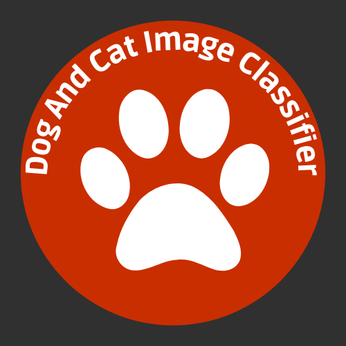
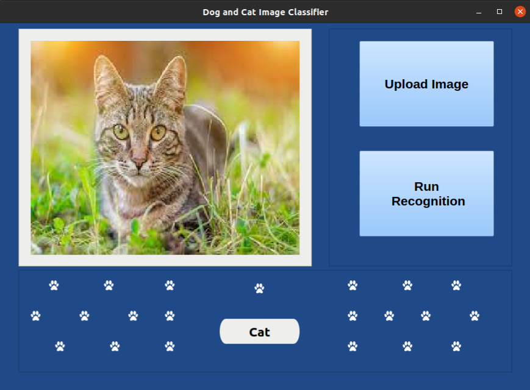

<!-- Project Logo --->

# Dog-and-cat-image-classifier 

## 📙 Project description

In this repository, a convolutional neural network was created to solve the problem of recognizing images of dogs and cats.

## 🖼️ Dataset

In this project, the [dataset of images of dogs and cats](https://www.kaggle.com/datasets/tongpython/cat-and-dog) was used. This dataset has 8005 images for training and 2023 images for testing because it is a reduced set.

## 🧠 Neural Network

The neural network used was a Convolutional Neural Network with the following parameters:
- 3 blocks composed of: a layer of **filters**, a layer of **BatchNormalization**, a layer of **Max Pooling** and a layer of **Dropout 20%**.
- A layer **Flatten**.
- **Two hidden layers** with **128 neurons** and with the **ReLU** activation function followed by a **Dropout of 30% and 40%** respectively.
- An output layer with 1 neuron and with the sigmoid activation function.

## 📊 Metrics
The CNN created reached an **accuracy of 81.07%** with a training time of approximately **32 minutes** on a machine with the following setup:
- **CPU:** Ryzen 5 3400G.
- **RAM memory:** 16 GB DRR4 2666Mhz (2x8).
- **OS:** Linux Ubuntu 20.04.4 LTS.

## 💡 Features
- In this project, it is possible to model and train a CNN with the dataset of images of dogs and cats to recognize both classes.

- A graphical interface was also created for users to upload an image to be classified by CNN:

## 🔨 Techniques and technologies:
- ``Python 3.8.10``
- ``Tensorflow 2.8.0``
- ``PyQt5 5.15.4``
- ``Matplotlib 3.5.1``

## Author
[ Douglas Araújo](https://github.com/DouglasArS)